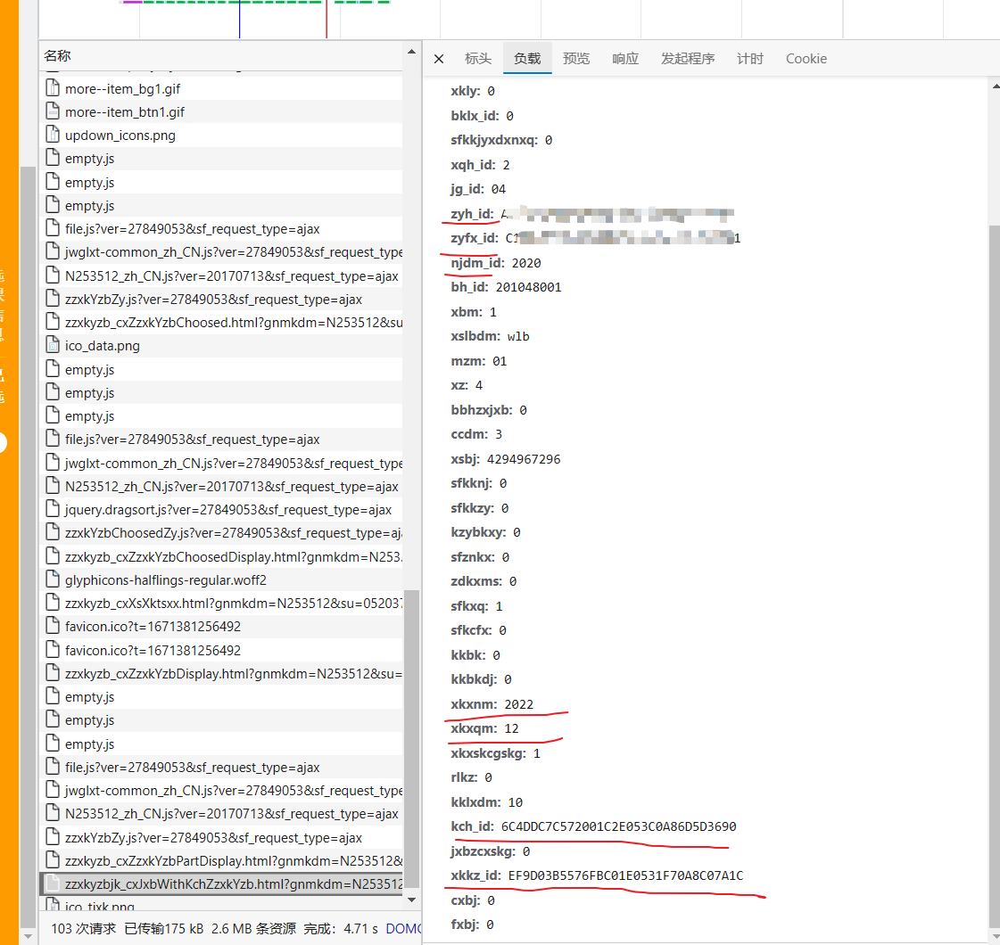

# CMUT劳动实践脚本
## V0.1

一共分为三次网络请求即可：

- 第一次查询出所有有余量的课程
- 第二次查询一个课的详细信息
- 第三次直接选课

分别对应`selectClass` `getDetail` `chooseClass` 三个函数

### url

选择勾选上有余量的，打开F12，点击查询，看一下对应的url


对getDetail和chooseClass做同样处理，

### 具体参数

其中有一些涉及时间还有开设学期的具体参数，通过f12获取一下当前的参数进行替换即可，直接将curl命令转为代码然后进行替换

### sendRequest

对于三次发送网络请求做了一个提取，建议自己发送一下请求然后复制转成代码，然后把所有设置请求头的全都给修改了

[在线curl命令转代码 (lddgo.net)](https://www.lddgo.net/convert/curl-to-code)

```go
req.Header.Set("Accept", "application/json, text/javascript, */*; q=0.01")
	req.Header.Set("Accept-Language", "zh-CN,zh;q=0.9,en;q=0.8,en-GB;q=0.7,en-US;q=0.6")
	req.Header.Set("Connection", "keep-alive")
	req.Header.Set("Content-Type", "application/x-www-form-urlencoded;charset=UTF-8")
	req.Header.Set("Cookie", "JSESSIONID=8CB6AFC0C133EC04CD01420966E06F37; BIGipServerp_new_hr_-_authserver.cumt.edu.cn=590601179.20480.0000; TWFID=ce6df074dc70d085")
	req.Header.Set("Origin", "https://jwxk1-cumt-edu-cn.webvpn.cumt.edu.cn:8118")
	req.Header.Set("Referer", "https://jwxk1-cumt-edu-cn.webvpn.cumt.edu.cn:8118/jwglxt/xsxk/zzxkyzb_cxZzxkYzbIndex.html?gnmkdm=N253512&layout=default&su=xuehao") // 此处为学号
	req.Header.Set("Sec-Fetch-Dest", "empty")
	req.Header.Set("Sec-Fetch-Mode", "cors")
	req.Header.Set("Sec-Fetch-Site", "same-origin")
	req.Header.Set("User-Agent", "Mozilla/5.0 (Windows NT 10.0; Win64; x64) AppleWebKit/537.36 (KHTML, like Gecko) Chrome/108.0.0.0 Safari/537.36 Edg/108.0.1462.54")
	req.Header.Set("X-Requested-With", "XMLHttpRequest")
	req.Header.Set("sec-ch-ua", `"Not?A_Brand";v="8", "Chromium";v="108", "Microsoft Edge";v="108"`)
	req.Header.Set("sec-ch-ua-mobile", "?0")
	req.Header.Set("sec-ch-ua-platform", `"Windows"`)
```

### main

在main函数中设置一下cookie即可

```
cookie := Cookie{
   JSESS: "xxxxx6F37",
   BIGipServer: "590601xxx179.xxxxxx.0000",
   TWFID: "xxxx7xx0dxxxxx085",

}
```

`doTaskSequential` 为串行实现，`doTaskWithGoRoutines` 开启三个子协程并行发送网络请求，

发送频率为单个协程一秒一次，频率再高的话就会可能触发教务设置的抢课频率上限


因为需要预先去发送网络请求去先获取一定的数据，因此基本上只能用于捡漏别人剩下的，第一次抢由于参数可能有变大概率是没法正常使用的

本身很粗糙，不是开箱即用的，需要自己再对着改改

## V0.2

浏览器F12看一下一些课程还有个人的信息 cookie之类的，就算没放课依旧可以查询



感觉没必要弄成配置文件的形式于是就做成了一个全局变量的形式

设置一下学号、cookie 专业Id，选课学年 等等基本就可以直接跑了

```
var (
   // 设置学号
   studentId = ""
   urlToSearch = "https://jwxk1-cumt-edu-cn.webvpn.cumt.edu.cn:8118/jwglxt/xsxk/zzxkyzb_cxZzxkYzbPartDisplay.html?gnmkdm=N253512&su="+studentId+"&sf_request_type=ajax"
   urlToGetDetail = "https://jwxk1-cumt-edu-cn.webvpn.cumt.edu.cn:8118/jwglxt/xsxk/zzxkyzbjk_cxJxbWithKchZzxkYzb.html?gnmkdm=N253512&su="+studentId+"&sf_request_type=ajax"
   urlToChoose = "https://jwxk1-cumt-edu-cn.webvpn.cumt.edu.cn:8118/jwglxt/xsxk/zzxkyzbjk_xkBcZyZzxkYzb.html?gnmkdm=N253512&su="+studentId+"&sf_request_type=ajax"
   // 设置 cookie
   cookieJESS = ""
   cookieBigServer = ""
   cookieTWFID = ""
   // 选课的学年
   classYear  = "2022"
   // 设置自己的年级
   grade = "2020"
   // 设置自己的专业Id
   majorId = "A737C8D6D90A009EE053C0A86D5D8E09"
   classType1 = "10" // 10为公选课 18为劳动
   classType2 = "1" // 1为公选 0 为劳动


   //公选课：EF9D03B5576FBC01E0531F70A8C07A1C 劳动课：EF9E3D0F99E56F21E0531F70A8C0CC18
   //不同人可能不一样，需要提前查询
   classTypeId = "EF9D03B5576FBC01E0531F70A8C07A1C"

   // 是否根据课程名称查询 注：需要提供准确名称，
   //如果提供模糊名称则会查出多个课最后去选择第一个，后续的可能和第一个冲突而选不上
   selectByName = true
   className = "风景背后的地质学"

   userAgent = "Mozilla/5.0 (Windows NT 10.0; Win64; x64) AppleWebKit/537.36 (KHTML, like Gecko) Chrome/108.0.0.0 Safari/537.36 Edg/108.0.1462.54"

)
```

### 持久化

选课记录会持久化成一份txt文件保存在log目录下，选课成功的记录在successLog下，选课失败的记录在errorLog下

通过开子协程的方式去进行磁盘IO，对抢课的性能应该不会有太大的影响


后续再设计一个缓冲区和一个简单的lockManager去对记录去个重

